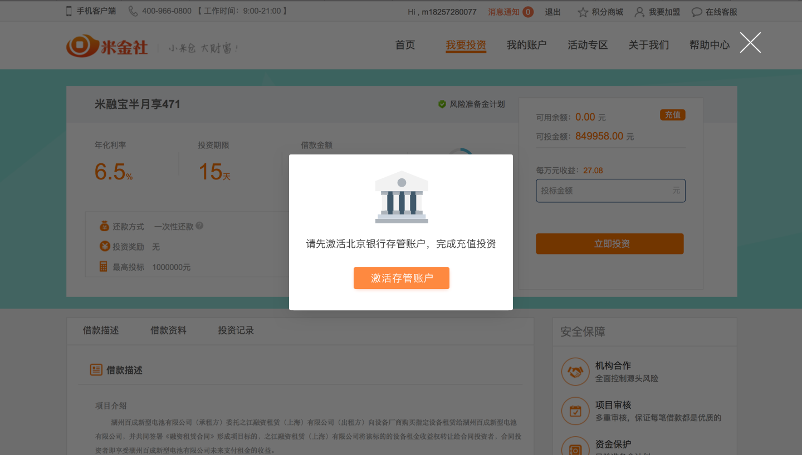
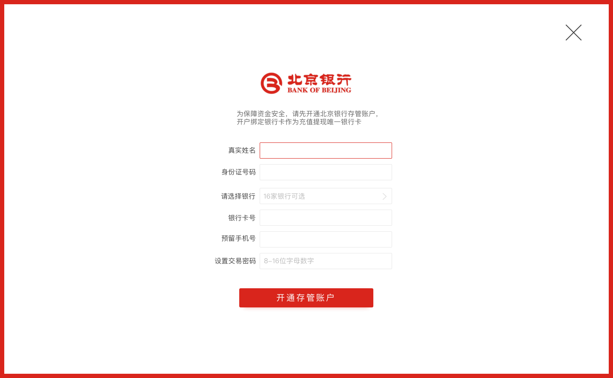
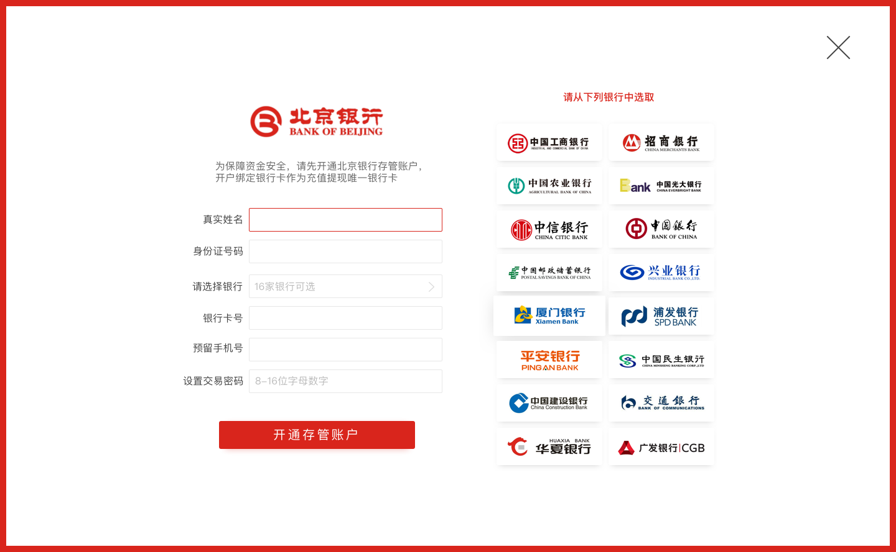
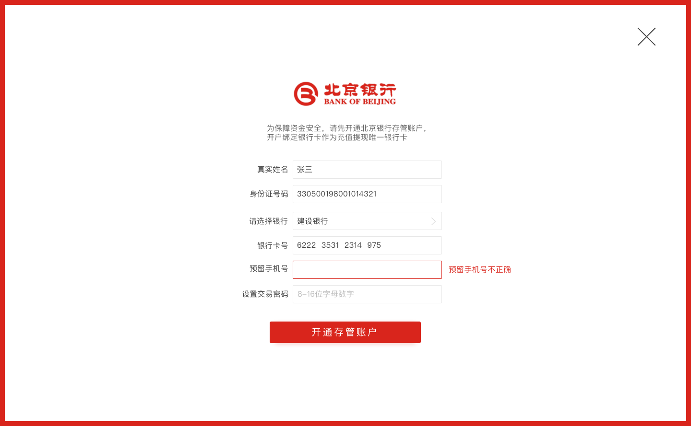
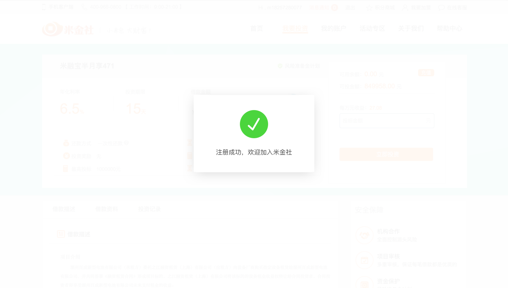
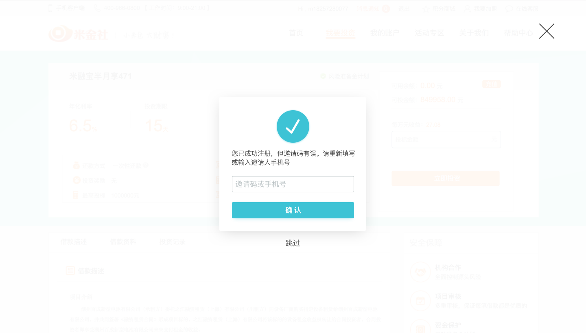

# 绑卡流程

### 绑卡弹窗提示
- 该页面前置条件为用户尝试投资或者充值时未通过北京银行验证
- 点击激活存管账户进入激活存管账户页面
- 点击取消弹窗消失

### 绑卡页面
- 点击请选择银行弹出银行列表页面，原有部分整体左移
- 身份证、银行卡号、预留手机号输入位数超过固定位数则不能再输入
- 点击右方X为回到入口页面
- 点击开通存管账户进入表单判断，表单判断分为前端判断，后端判断，北京银行判断
- 如果错误次数超过3次，加验证码
- 如果通过验证，则给出「存管账户已成功激活」提示，如果有弹窗入口进来则，返回弹窗相应页面，如果从设置中进入，返回相应设置页面

表单前端验证
- 真实姓名不能为空「真实姓名不能为空」
- 真实姓名只有一位或者超过11位，真实姓名中有字母或者数字情况或者除了点外的特殊字符「请输入您的真实姓名」
- 身份证号码为空「身份证号码不能为空」
- 身份证位数不对，或者非数字及X「请输入正确的身份证号码」
- 身份证正则需要讨论是否有稳定正则，如有放前端，如没有放后端
- 银行卡为空「银行卡号不能为空」
- 银行卡位数位数错误，非数字或者开头一位数号码不对「请输入正确的银行卡号」
- 预留手机号为空「预留手机号不能为空」
- 预留手机号位数错误，非数字，开头不为1「请输入正确的银行预留手机号」
- 支付密码前端判断与之前登录密码设置一样，也有提示文字和相关错误信息，placeholder文字为「8-16位字母数字」，错误提示「登录密码为8-16位字母与数字，且至少包含一位字母和数字」
- 错误信息提示在错误选项右方
- 判断为从上到下

表单后端验证
- 真实姓名正则表达2-5个汉字，特殊情况为2-5个汉字·2-5个汉字，如果错误「请输入您的真实姓名」
- 身份证详情正则表达式，错误提示「请输入正确的身份证号码」
- 银行卡号正则表达且对应出相应银行，如果用户已选银行且选择错误，自动跳转到银行卡号对应银行，如果用户没有选择银行，判断后自动填入相应银行，如果用户选择银行正确，不做处理。
- 银行卡号没通过正则提示「请输入正确的银行卡号」
- 银行卡号判断出银行超出银行列表范围时提示「暂不支持当前银行卡所属银行，请点击银行列表查看可选银行」
- 预留手机号做部分正则表达，错误提示「请输入正确的银行预留手机号」
- 支付密码判断与登录密码设置一样，多一个「支付密码不能和登录密码相同」提示
- 判断为从上到下

北京银行验证
- 银行反馈相应验证信息

##### 支持银行列表
- 16家银行都为可选，如果点击，列表收回，并在银行卡位置中显示选择的银行卡
- 如果之前有选择或自动判断出的银行，选择后替代原有的银行

### 绑卡成功状态
- 绑定成功提示状态3秒，然后自动跳转至接下来的投资流程或者设置页面
- 如果点X直接进入

### 设置端改动
- 设置端将实名认证和银行卡统一归为存管账户
- 取消单独银行卡设置页

# 注册相关

### 注册第二步骤
- 将注册流程第三步修改用户名去除
- 如果用户完成第二步注册，则提示注册成功，不再返回登录页面，直接刷新进入口页面
- 用户注册失败给出相应提示
- 如果用户短信验证和设置登录密码都通过，但邀请码错误，进入邀请码错误页面

### 邀请码错误页面
- 这个页面出现的前提是用户必要项输入成功完成注册，但验证码错误
- 点X，点跳过都是进入入口页面，不再提示注册正确
- 点击确认验证是否正确

表单验证
- 邀请码为空「邀请码或手机号不能为空」
- 邀请码错误「请填写正确的邀请码或手机号」
