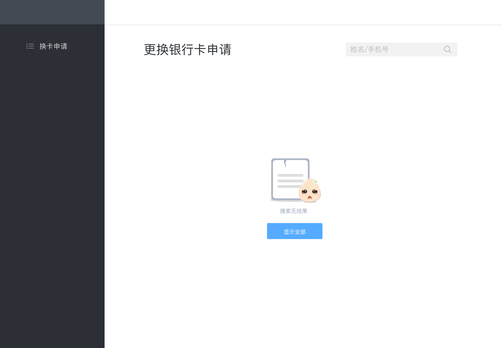

# 重新绑卡后台

### 申请页面
- 右上方搜索检索条件为姓名、手机号，如有结果下方直接显示结果，没有结果显示空状态，点击显示全部回到列表页面
- 单条申请记录里有姓名，手机号，申请时间，处理状态
- 状态分平台待审核、银行待审核、审核通过、未通过待沟通、未通过已沟通、异常状态待沟通
- 部分状态红色显示，带叹号表示需要客服进一步操作

### 平台审核页面
- 为平台待审核页面
- 右上方显示当前状态和申请时间
- 左上方显示申请人姓名和注册手机号
- 下方显示原卡号、所属银行、身份证号、新卡号、所属银行、预留手机号
- 右边显示用户上传照片，点击后新开标签页打开
- 按钮为通过和不通过，点击通过向银行发起换卡请求，状态变成银行审核中，点击不通过变成不通过状态，等待客服通知用户

### 平台未通过页面
- 下方显示平台审核、银行审核、客服沟通三种状态
- 显示平台审核时间，并显示未通过状态
- 客服沟通区域等待客服处理沟通，列表页面为未通过待沟通

### 银行审核页面
- 银行审核中状态，不能操作，等待银行返回结果

### 银行通过页面
- 银行解绑通过，换卡成功状态
- 显示通过时间

### 银行解绑未通过页面
- 银行解绑未通过，待处理状态
- 下方显示银行解绑未通过原因
- 为客服待沟通状态

### 银行解绑成功，换卡失败页面
- 显示银行反馈信息
- 显示重新提交按钮，点击后会再次尝试向银行申请绑卡，状态变成复审中

### 重新绑卡复审页面
- 如果成功进入通过页面
- 如果失败进入客服处理页面
- 列表页面为银行处理中

### 复审失败页面
- 显示客服沟通状态

### 点击已沟通页面
- 显示已经沟通状态，列表页面显示未通过已沟通状态
