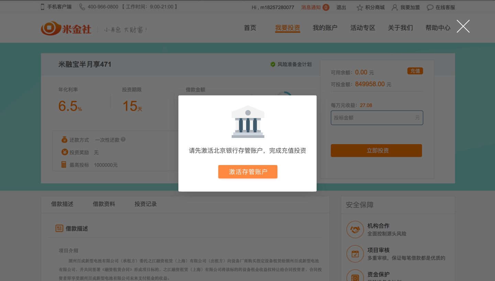
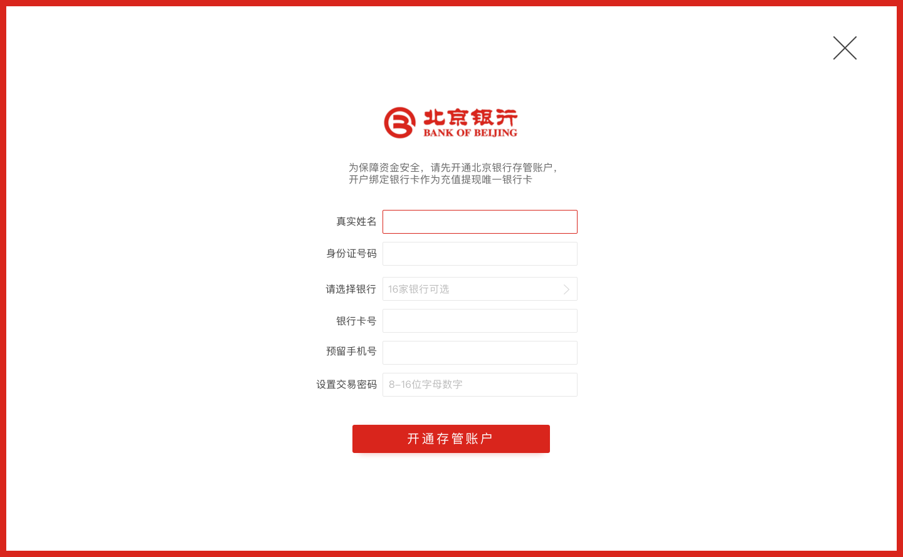
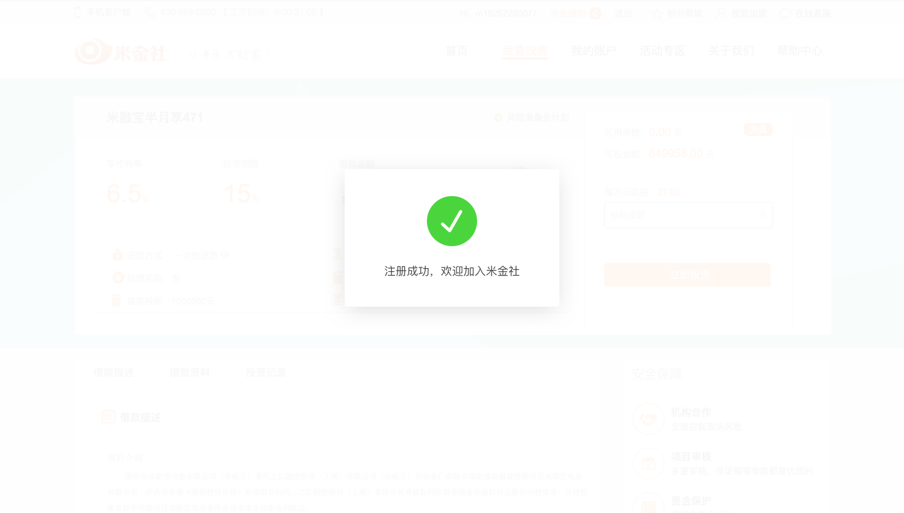
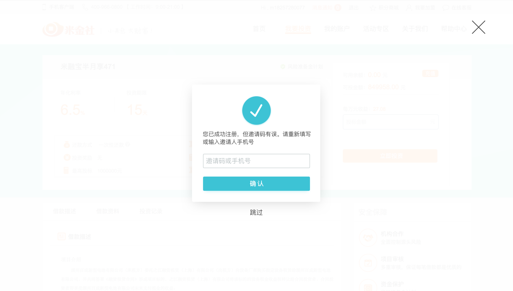
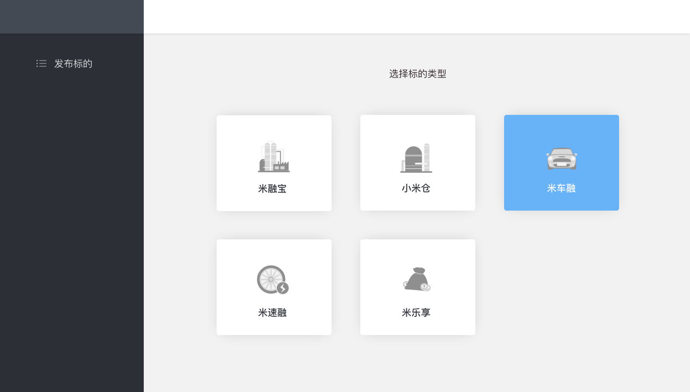
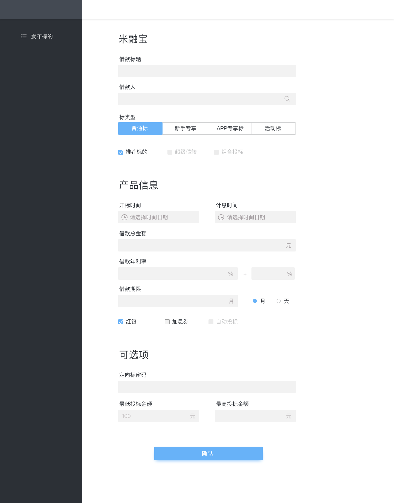
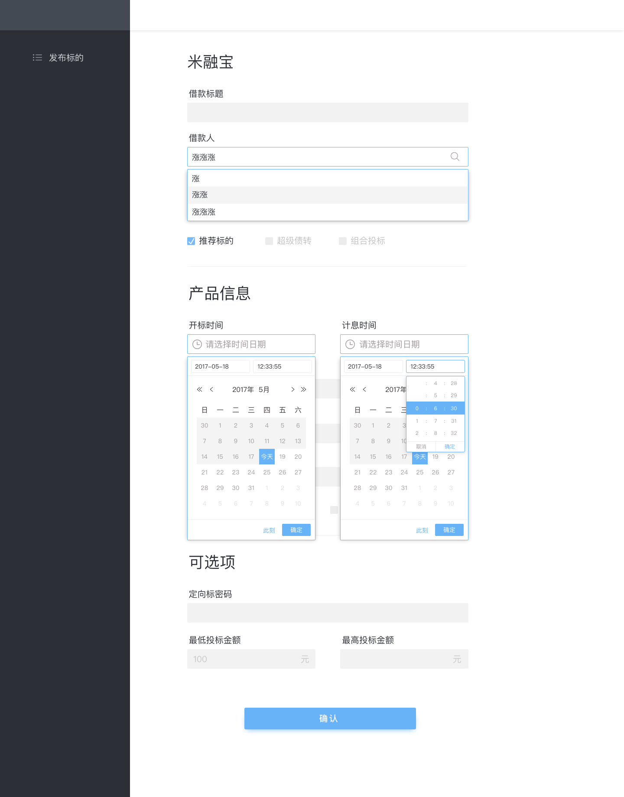
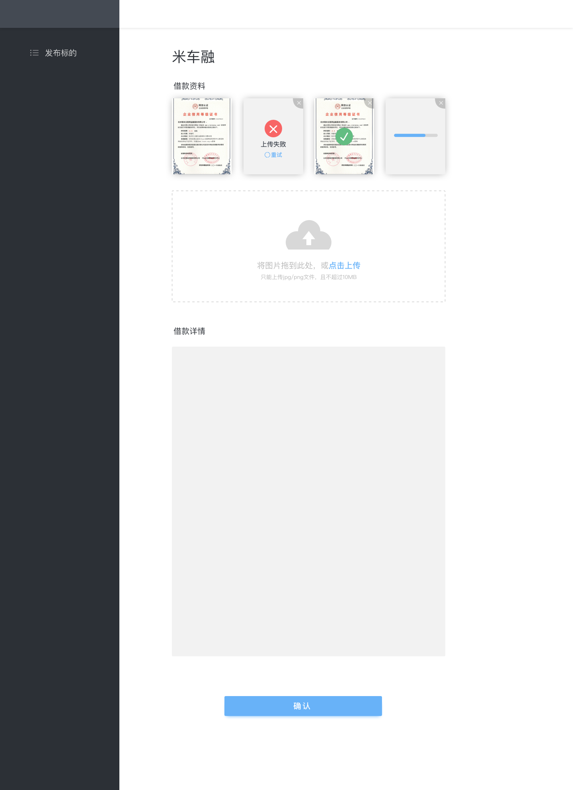
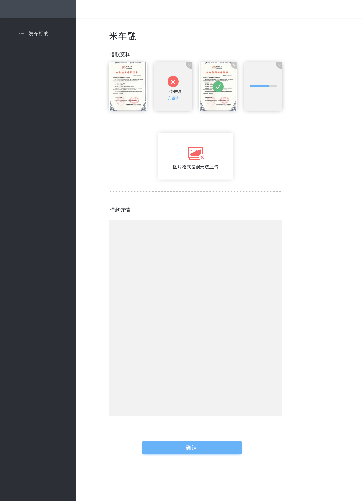

# 绑卡流程

### 绑卡弹窗提示
- 该页面前置条件为用户尝试投资或者充值时未通过北京银行验证
- 点击激活存管账户进入激活存管账户页面
- 点击取消弹窗消失

### 绑卡页面
- 点击请选择银行弹出银行列表页面，原有部分整体左移
- 身份证、银行卡号、预留手机号输入位数超过固定位数则不能再输入
- 点击右方X为回到入口页面
- 点击开通存管账户进入表单判断，表单判断分为前端判断，后端判断，北京银行判断
- 如果错误次数超过3次，加验证码
- 如果通过验证，则给出「存管账户已成功激活」提示，如果有弹窗入口进来则，返回弹窗相应页面，如果从设置中进入，返回相应设置页面

表单前端验证
- 真实姓名不能为空「真实姓名不能为空」
- 真实姓名只有一位或者超过11位，真实姓名中有字母或者数字情况或者除了点外的特殊字符「请输入您的真实姓名」
- 身份证号码为空「身份证号码不能为空」
- 身份证位数不对，或者非数字及X「请输入正确的身份证号码」
- 身份证正则需要讨论是否有稳定正则，如有放前端，如没有放后端
- 银行卡为空「银行卡号不能为空」
- 银行卡位数位数错误，非数字或者开头一位数号码不对「请输入正确的银行卡号」
- 预留手机号为空「预留手机号不能为空」
- 预留手机号位数错误，非数字，开头不为1「请输入正确的银行预留手机号」
- 支付密码前端判断与之前登录密码设置一样，也有提示文字和相关错误信息，placeholder文字为「8-16位字母数字」，错误提示「登录密码为8-16位字母与数字，且至少包含一位字母和数字」
- 错误信息提示在错误选项右方
- 判断为从上到下

表单后端验证
- 真实姓名正则表达2-5个汉字，特殊情况为2-5个汉字·2-5个汉字，如果错误「请输入您的真实姓名」
- 身份证详情正则表达式，错误提示「请输入正确的身份证号码」
- 银行卡号正则表达且对应出相应银行，如果用户已选银行且选择错误，自动跳转到银行卡号对应银行，如果用户没有选择银行，判断后自动填入相应银行，如果用户选择银行正确，不做处理。
- 银行卡号没通过正则提示「请输入正确的银行卡号」
- 银行卡号判断出银行超出银行列表范围时提示「暂不支持当前银行卡所属银行，请点击银行列表查看可选银行」
- 预留手机号做部分正则表达，错误提示「请输入正确的银行预留手机号」
- 支付密码判断与登录密码设置一样，多一个「支付密码不能和登录密码相同」提示
- 判断为从上到下

北京银行验证
- 银行反馈相应验证信息

##### 支持银行列表
- 16家银行都为可选，如果点击，列表收回，并在银行卡位置中显示选择的银行卡
- 如果之前有选择或自动判断出的银行，选择后替代原有的银行

### 绑卡成功状态
- 绑定成功提示状态3秒，然后自动跳转至接下来的投资流程或者设置页面
- 如果点X直接进入

### 设置端改动
- 设置端将实名认证和银行卡统一归为存管账户
- 取消单独银行卡设置页

# 注册相关

### 注册第二步骤
- 将注册流程第三步修改用户名去除
- 如果用户完成第二步注册，则提示注册成功，不再返回登录页面，直接刷新进入口页面
- 用户注册失败给出相应提示
- 如果用户短信验证和设置登录密码都通过，但邀请码错误，进入邀请码错误页面

### 邀请码错误页面
- 这个页面出现的前提是用户必要项输入成功完成注册，但验证码错误
- 点X，点跳过都是进入入口页面，不再提示注册正确
- 点击确认验证是否正确

表单验证
- 邀请码为空「邀请码或手机号不能为空」
- 邀请码错误「请填写正确的邀请码或手机号」

# 后台发标页面

### 选择标的类型
- 发标后进入标的类型选择页面
- 类型可以调整，类型有个标签是是否固定资料模板，如果固定，则填写完标的信息后不再显示资料补充页面；如果不固定，填写完标的信息页后进入资料补充页面
- hover上标的类型时颜色发生变化
- 点击相应类型后进入相应类型的标的信息填写页面

### 标的信息填写页面
- 选择什么类型标的大标题就是相应标的
- 借款人信息输入部分后自动匹配
- 标类型默认普通标，单选框
- 推荐标的默认打勾，超级债转和组合投标这个版本不显示
- 开标时间和计息时间选择时间框参照饿了么组件的样式，能选择精确时间，也能选择当前时间
- 开标时间不能小于当前时间
- 计息时间必须大于开标时间
- 借款总金额单位为元
- 借款年利率正常年利率+额外年利率，额外可选但通常不选
- 借款期限默认为月，选择天后输入框单位也发现变化
- 红包加息券默认为勾选状态，自动投标本版本不出现
- 可选项都是可选的，最高投标金额必须大于最低投标金额
- 点击确认进入表单验证，如果不通过报相应错误，红边框提示错误输入框，错误信息放输入框底部，红字显示，点击后再次修改则不再显示错误信息
- 如果成功则判断类型是否固定模板资料，如果非固定进入资料补充页面
- 点X弹确认框问是否取消表单填写

表单验证
- 借款标题为空「借款标题不能为空」
- 借款标题输入完成后有两个判断，一个是验证是否与标的类型一致「借款标题必须与标的类型一致」；一个是标的不能和数据库内名称重名「借款标题不能重复」
- 借款人为空「借款人不能为空」
- 借款人与数据库步匹配「请输入正确的借款人」
- 开标时间为空「开标时间不能为空」
- 计息时间为空「计息时间不能为空」
- 计息时间小于开标时间「计息时间不能早于开标时间」
- 借款总金额为空「借款总金额不能为空」
- 借款总金额为非数字「请输入正确的借款总金额」
- 借款年利率为空「借款年利率不能为空」
- 借款年利率非数字，或大于20小于1「请输入正确的借款年利率」
- 借款期限为空「借款期限不能为空」
- 借款期限为非正整数「请输入正确借款期限」
- 最低投标金额默认，最高投标金额小于100「最低投标金额默认为100，大于最高投标金额」
- 最高投标金额小于最低投标金额「最高投标金额不能小于最低投标金额」
- 最低投标金额必须大于等于0的整数「请输入正确的最低投标金额」
- 最高投标金额必须为正整数「请输入正确的最高投标金额」

### 资料补充页面
- 借款资料部分点「点击上传」出来选择文件上传框，同时支持用户直接拖转图片到拖拽区域
- 选择或者拖拽后检测图片格式，只支持png,jpg,且不超过10M
- 确认格式正确需要一个传输状态，进度条显示
- 上传失败显示失败状态，点击重试重新发送
- 上传成功后有成功提示，2s后消失
- 点击图像右上角X可以删除上传失败、上传中、及上传成功图像
- 借款详情框沿用之前富文本组件
- 点击确认做验证，借款详情为空则提示「借款详情不能为空」
- 点X弹确认框问是否取消表单填写

### 核实页面
- 核实页面右边为确认框，固定不变
- 左边可滚动
- 点X弹确认框问是否取消表单填写
- 如果信息没有选择，则不在左边显示
- 点击核实并确认，提交表单
- 点击编辑修改回到标的信息填写页面，同时保留相关填写数据，如果是带资料的，进入第二页资料依旧保持原有数据

# 充值提现相关
